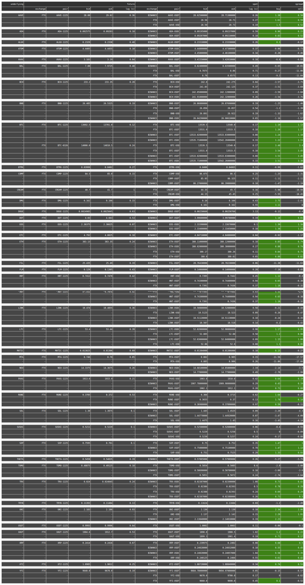

##### ABOUT  
A future to spot premium monitor.   
- A redis database is updated real-time through websocket connections to different exchanges with the prices and basis.
- Python's Dash framework is then used to monitor the premiums.

##### WORKING SNAPSHOT
